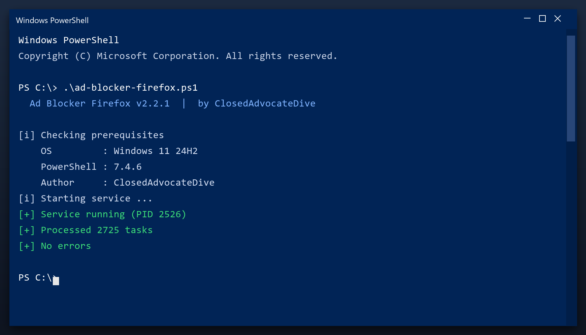

# Ad Blocker Firefox — Free Download [2026]

 

Ad blocker firefox is a lightweight Windows program for maintaining your system. It runs offline, uses very little memory and does not slow your computer down. **Completely free.**

  

  

## Questions & Answers

**Will it speed up my games?**

It can help by freeing RAM and stopping background tasks, but it is not a game booster.

**Does it delete my downloads?**

No. It only removes temporary and leftover data, never your own files.

**Can I schedule it?**

Yes, you can set it to run weekly automatically.

**What if I do not like it?**

Uninstall it normally from Windows Settings - it leaves nothing behind.

## What Is It

Ad blocker firefox is a maintenance tool for Windows. It scans your system for problems such as leftover files and invalid registry entries, then removes or repairs them. Everything happens locally on your PC - nothing is uploaded anywhere.

| **Term** | **Meaning** |
| --- | --- |
| **Registry** | The Windows database of settings |
| **Junk files** | Temporary files left behind by programs |
| **Startup items** | Programs that launch with Windows |
| **Optimize** | Make the system run faster |

## The Problem

- **Slower over time** - a PC never stays as fast as it was new
- **Long shutdowns** - Windows waits on stuck programs
- **High memory use** - idle apps keep eating RAM
- **Registry bloat** - thousands of dead entries
- **Messy downloads** - duplicate files everywhere

## The Fix

| **Problem** | **Solution** |
| --- | --- |
| **Low disk space** | Free up space safely |
| **Freezes and errors** | Repair system entries |
| **Manual cleaning** | One-click maintenance |
| **Fake tools** | Tested build on this page |
| **Hard to use** | Simple, plain settings |

## Step by Step

1. **Get the file** with the button below
2. **Allow** it in Windows SmartScreen (More info, Run anyway)
3. **Open** the tool
4. **Press Start scan** and wait a couple of minutes
5. **Click Clean** to remove what was found

> **Note:** run the tool as administrator so it can clean system folders. Without admin rights it will only touch your own user files.

## Features

| **Feature** | **Details** |
| --- | --- |
| **Size** | Small download, quick install |
| **Scan speed** | Typically under 3 minutes |
| **Background use** | None when closed |
| **Ads** | None |
| **Bundled extras** | None |
| **Offline** | Works without internet |

## Requirements

| **Component** | **Details** |
| --- | --- |
| **OS** | Windows 10, 11 |
| **Architecture** | 64-bit |
| **RAM** | 2 GB minimum |
| **Disk space** | 100 MB |
| **Admin rights** | Yes, for cleanup tasks |
| **Internet** | Only to download |

## What You Get

| **Component** | **Details** |
| --- | --- |
| **Installer** | Single file, no extras |
| **Readme** | Short setup notes |
| **Restore point** | Made automatically |
| **Uninstaller** | Standard Windows removal |

## Tips

- Start with a quick scan before a deep scan
- Deep scans take longer but find more
- Check free space before and after
- Note any errors and check the FAQ
- Repeat monthly for consistent speed

## Troubleshooting

| **Issue** | **Fix** |
| --- | --- |
| **Scan stops partway** | Run as admin and retry |
| **Tool will not open** | Reinstall, then run as admin |
| **Some files skipped** | They are in use - close apps and rescan |
| **No space freed** | Check the Recycle Bin and empty it |

## Summary

**Ad blocker firefox** is a small, honest Windows utility. It cleans what should be cleaned, shows you what it found, and leaves everything else alone.

- No adware, no upsells
- No account needed
- Runs only when you open it
- Free 2026 build

**Get it from the button above.**

---

*rogue-moss-486 · Updated 2026-10-08 · Shared under the MIT License*
